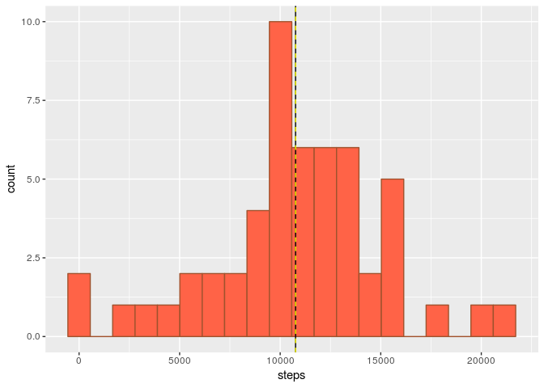
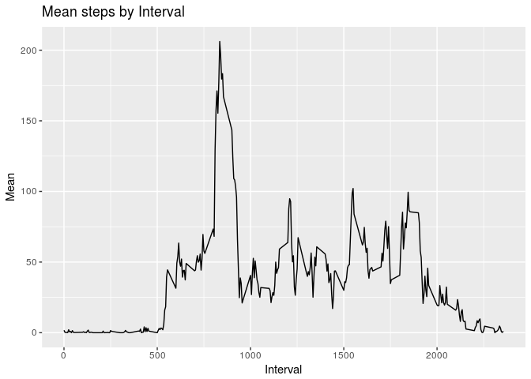
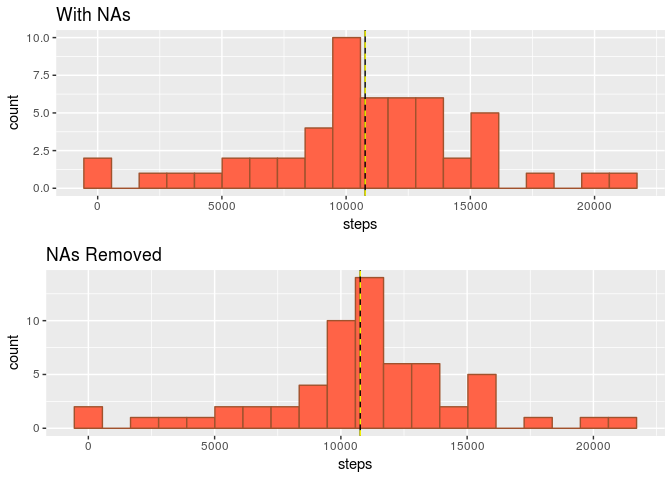
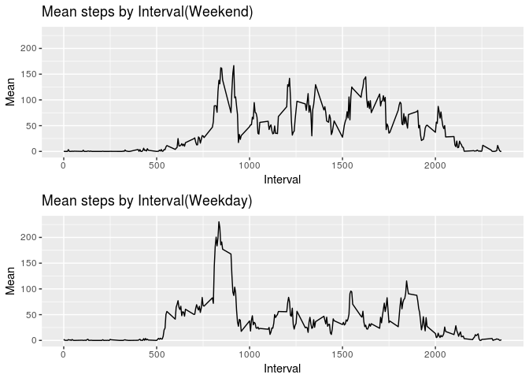

# Reproducible Research: Peer Assessment 1


## Loading and preprocessing the data

First let's load the data from the csv file.


```r
suppressPackageStartupMessages(library(ggplot2))
suppressPackageStartupMessages(library(gridExtra))
suppressPackageStartupMessages(library(dplyr))
unzip("activity.zip")
ac <- read.csv("activity.csv", colClasses = c("numeric", "Date", "factor"))
```

## What is mean total number of steps taken per day?

We'll use tapply to grab a sum of the steps by day. We'll then remove the NAs so they don't show up as zeroes and shift the mean and median towards the left.


```r
dailySteps <- tapply(ac$steps, ac$date, sum)
dailySteps <- data.frame(steps = dailySteps[!is.na(dailySteps)])
mn=mean(dailySteps$steps)
md=median(dailySteps$steps)
ds1 <- ggplot(dailySteps, aes(steps))+geom_histogram(bins=20, fg="sienna", bg="tomato")+geom_vline(xintercept=md)+geom_vline(xintercept=mn, lty=2, col="yellow")
print(ds1)
```

<!-- -->

We can see the number of daily steps tending towards a Normal Distribution, with a mean of 10766 shown above with a solid line, and a median of 10765 as the dashed line


## What is the average daily activity pattern?

To check for a daily pattern, we'll average by interval across the recorded days, then format the results into a data frame and arrange by interval


```r
by.interval <- tapply(ac$steps, ac$interval, mean, na.rm=T)
by.interval <- data.frame(interval = as.numeric(names(by.interval)), mean=by.interval)
row.names(by.interval) <- 1:nrow(by.interval)
by.interval <- arrange(by.interval, interval)
ggplot(by.interval, aes(interval, mean))+geom_line(lwd=.5)+ggtitle("Mean steps by Interval")+xlab("Interval")+ylab("Mean")
```

<!-- -->

## Imputing missing values


```r
missing.steps <- sum(is.na(ac$steps))
missing.stepsp <- missing.steps/nrow(ac)*100
```

It seems there are quite a few missing values. Upon inspection we find there are 2304, or about 13.11%, of the steps values missing.

We could impute the values by taking either the mean from the date, or the mean from the interval.  To compare which would be better, I decided to check which method had the lower average variance..


```r
date.var <- mean(sapply(split(ac, ac$date), function(x) {var(x$steps, na.rm=T)}),na.rm=T)
interval.var <- mean(sapply(split(ac, ac$interval), function(x) {var(x$steps, na.rm=T)}))
```

We find the variance by date is 12369, while the variance by interval is 11264, so we'll use the interval mean to impute the missing values.


```r
ac.imputed <- data.frame(ac)
for(i in seq_along(ac.imputed[,1])) {
     if(is.na(ac.imputed[i,1])) {
         ac.imputed[i,1] <- by.interval[by.interval$interval == as.numeric(as.character(ac[i,3])),]$mean
  }
}
```

So now lets recompute the mean daily steps now that we have imputed the missing values:


```r
dailySteps2 <- tapply(ac.imputed$steps, ac.imputed$date, sum)
dailySteps2 <- data.frame(steps = dailySteps2)
mn2=mean(dailySteps2$steps)
md2=median(dailySteps2$steps)
ds2 <- ggplot(dailySteps2, aes(steps))+geom_histogram(bins=20, fg="sienna", bg="tomato")+geom_vline(xintercept=md)+geom_vline(xintercept=mn, lty=2, col="yellow")+ggtitle("NAs Removed")
ds1 <- ds1 + ggtitle("With NAs")
grid.arrange(ds1, ds2)
```

<!-- -->

Removing the NAs didn't have the effect I would have assumed on the mean and median, though.


```r
change <- matrix(c(mn, mn2, md, md2), c(2,2), dimnames=list(c("Before", "After"), c("Mean", "Median")))
change
```

```
##            Mean   Median
## Before 10766.19 10765.00
## After  10766.19 10766.19
```

Though it did seem to narrow the IQR and standard deviation


```r
iqr0 <- IQR(dailySteps$steps)
sd0 <- sd(dailySteps$steps)
iqr1 <- IQR(dailySteps2$steps)
sd1 <- sd(dailySteps2$steps)

change2 <- matrix(c(iqr0, iqr1, sd0, sd1), c(2,2), dimnames=list(c("Before", "After"), c("Inter-Quartile Range", "Standard Deviation")))
change2
```

```
##        Inter-Quartile Range Standard Deviation
## Before                 4453           4269.180
## After                  2992           3974.391
```

## Are there differences in activity patterns between weekdays and weekends?

To start with, we'll add a factor variable to the data frame representing whether it was a weekday or weekend.


```r
ac.imputed <- mutate(ac.imputed, weekpart = ifelse(weekdays(date)%in%c("Saturday", "Sunday"), "Weekend", "Weekday"))
ac.imputed$weekpart <- as.factor(ac.imputed$weekpart)
```

Then we'll split it by that factor


```r
ac.weekend <- split(ac.imputed, ac.imputed$weekpart)$Weekend
ac.weekday <- split(ac.imputed, ac.imputed$weekpart)$Weekday
```

Now to compare the activity, we'll make a panel plot of each set for the mean by interval


```r
wexi <- tapply(ac.weekend$steps, ac.weekend$interval, mean)
wexi <- data.frame(interval =as.numeric(names(wexi)), mean=wexi)
row.names(wexi) <- 1:nrow(wexi)
wexi <- arrange(wexi, interval)

wdxi <- tapply(ac.weekday$steps, ac.weekday$interval, mean)
wdxi <- data.frame(interval =as.numeric(names(wdxi)), mean=wdxi)
row.names(wdxi) <- 1:nrow(wdxi)
wdxi <- arrange(wdxi, interval)

ll <- min(range(wexi$mean)[1], range(wdxi$mean)[1])
ul <- max(range(wexi$mean)[2], range(wdxi$mean)[2])

p1 <- ggplot(wexi, aes(interval, mean))+geom_line(lwd=.5)+ggtitle("Mean steps by Interval(Weekend)")+xlab("Interval")+ylab("Mean")+coord_cartesian(ylim=c(ll, ul))

p2 <- ggplot(wdxi, aes(interval, mean))+geom_line(lwd=.5)+ggtitle("Mean steps by Interval(Weekday)")+xlab("Interval")+ylab("Mean")+coord_cartesian(ylim=c(ll, ul))

grid.arrange(p1, p2)
```

<!-- -->

It appears that the subject is much more active throughout the day during the weekends, but has a larger spike of activity in the morning on weekdays.
